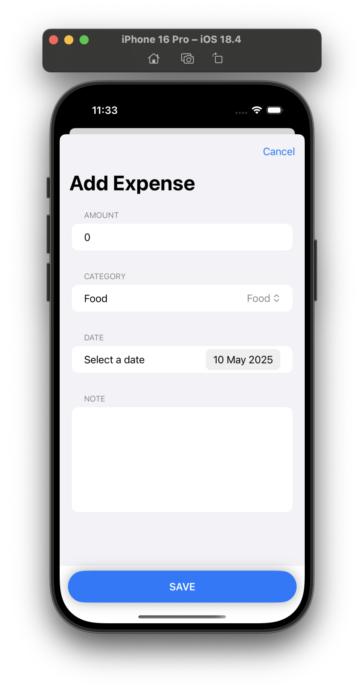

# 📱 Expense Tracker App

A modern iOS application built with SwiftUI to help users manage their daily expenses. Includes categorized spending, charts, and smooth animations.

## ✨ Features

- Add, edit, and delete expense entries
- View expenses grouped by date
- Animated pie chart of expenses by category
- Total expense tracking with AppStorage
- Smooth animations (on launch and in summary view)

## 🛠 Technologies

| Framework      | Purpose                            |
|----------------|------------------------------------|
| **SwiftUI**    | UI and navigation                  |
| **SwiftData**  | Local data persistence             |
| **Charts**     | Displaying expense summaries       |
| **AppStorage** | Saving total expenses              |
| **NavigationStack** | App flow navigation           |
| **Animations** | Enhancing UX with transitions      |

## 🧪 Requirements

- iOS 18+
- Xcode 16+
- Swift 6+

## 📷 Screenshots

### 🔸 Summary View  
This view displays total expenses and a pie chart of category spending with smooth animations.  

---

### 🔸 Expenses List  
A clean list showing daily expenses grouped by date. Tapping an item allows editing.  

---

### 🔸 Add/Edit Expense  
Users can quickly add or modify an expense entry, selecting category, amount, date, and notes.  

